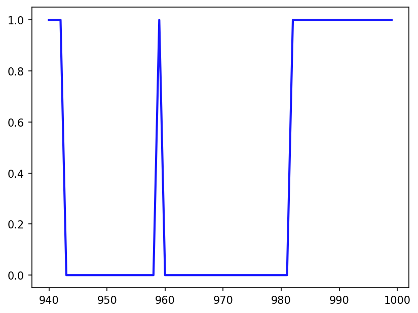
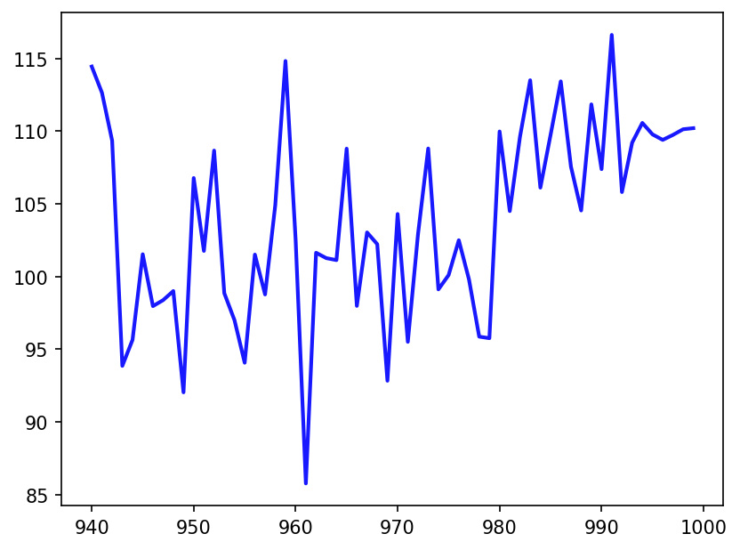
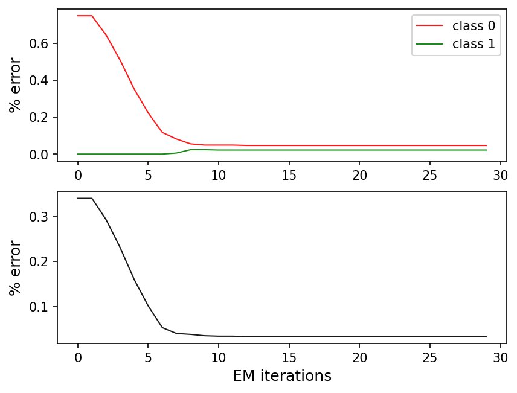
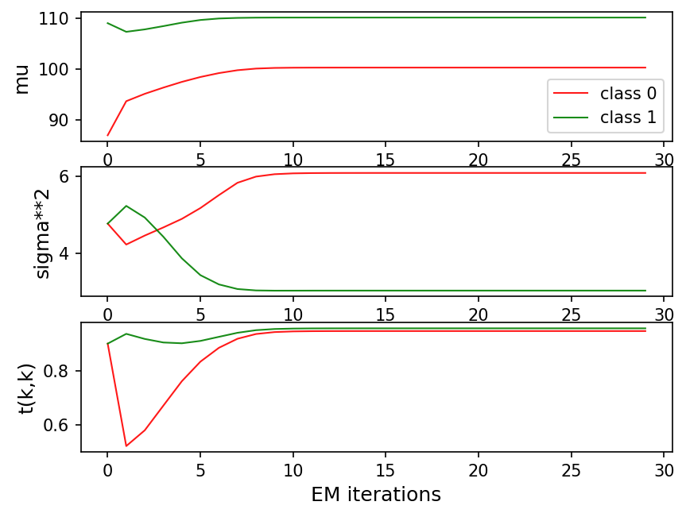
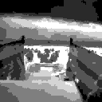

# TP Apprentissage bayésien - HMC Model
**Nathan Etourneau - Paul Flagel**
15 Mars 2022

## 1. Introduction
Dans ce TP, nous allons simuler des chaînes de Markov cachées, puis tenter d'estimer la chaîne de Markov cachée $X$ étant donnée les observations $Y$. Dans un premier temps, nous connaîtrons les paramètres $\mu$ et $\sigma$ permettant de générer les observations $Y$ à partir de la chaîne $X$, et dans un second temps nous estimerons également les paramètres $\mu$ et $\sigma$. Enfin, nous appliquerons cette reconstruction de chaîne de Markov cachée à un problème de débruitage d'image, et également de segmentation d'image.

## 2. Simulation d'une HMC
Dans cette partie, nous utilisons le programme `SimulHMC.py` nous permettant de simuler les états X et les observations Y sur 1000 exemples. En sélectionnant la matrice de transition t4 (où deux états 0 et 1 sont possibles), nous obtenons les figures suivantes dans `./results` pour les 60 derniers points :



Les paramètres des lois normales sont `mu = [100, 110]` et `sigma  = [6, 3]`.

Dans le répertoire `./sources`, le fichier `XY_t4.out` contient les valeurs des états séparées par des espaces, et les valeurs des observations. Il sera utilisé comme entrée pour la suite.

## 3. Restauration supervisée
Dans cette partie, nous simulons une chaîne de Markov cachée $(X, Y, I, t, \mu, \sigma)$, nous observons $Y$,  et nous cherchons à retrouver $X$, en connaissant $I, t, \mu, \sigma$.

Ainsi, nous cherchons à calculer $P(X_n = k, \mathbf{Y}_n) = \tilde{\gamma}_n(k)$

On sait que $\tilde{\gamma}_n(k) = \alpha_n(k) \cdot \beta_n(k)$, où les $\alpha_n(k)$ et les $\beta_n(k)$ s'obtiennent avec les méthodes `getAlpha` et `getBeta`. La méthode `getAlpha` est déjà implémentée, nous implémentons seulement `getBeta`.


On implémente `GetBeta()` dans le fichier `func.py`, terme qui se calcule par la méthode backwards :
```python
def getBeta(K, N, Y, mu, sigma, I, t, S):
    # backward computing
    beta = np.zeros(shape=(N, K))
    # N-th time step
    beta[N - 1, :] = np.ones(shape=(1, K))
    for n in range(N - 2, -1, -1):
        for k in range(K):
            for l in range(K):
                pdf = norm.pdf(Y[n + 1], loc=mu[l], scale=sigma[l])
                beta[n, k] += t[k, l] * pdf * beta[n + 1, l]
            beta[n, k] /= S[n + 1]
    return beta
```

Maintenant que nous disposons des $\alpha_n(k)$ et $\beta_n(k)$, nous reconstituons le signal $\mathbf{X}$ grâce à l'algorithme de Viterbi. Pour cela, nous implémentons la méthode `getMAPClassif()` fu fichier `func.py`.
```python
def getMAPClassif(K, N, Y, mu, sigma, I, t):
    # MAP classification (Viterbi algo)
    X_MAP = np.zeros(shape=(N))
    psi = np.zeros(shape=(N, K))
    delta = np.zeros(shape=(N, K))
    # First timestep
    for state in range(K):
        pdf = norm.pdf(Y[0], loc=mu[state], scale=sigma[state])
        delta[0, state] = np.log(I[state]) + np.log(pdf)
    for n in range(1, N):
        for state in range(K):
            pdf = norm.pdf(Y[n], loc=mu[state], scale=sigma[state])
            delta[n, state] = np.log(pdf) + np.max(
                delta[n - 1, :] + np.log(t[:, state])
            )
            psi[n, state] = np.argmax(delta[n - 1, :] + np.log(t[:, state]))
    X_MAP[N - 1] = np.argmax(delta[N - 1, :])
    for n in range(N - 2, 0, -1):
        X_MAP[n] = psi[n + 1, int(X_MAP[n + 1])]
    return X_MAP
```

Nous lançons le programme et nous obtenons des résultats intéressants :
```bash
I= [0.5 0.5] 
t= [[0.95 0.05]
 [0.05 0.95]]
Confusion matrix for MPM:
 [[486.  19.]
 [ 14. 481.]]
Global error rate for MPM: 0.033
By class error rate for MPM: [0.03762376 0.02828283]
Confusion matrix for MAP:
 [[491.  14.]
 [ 12. 483.]]
Global error rate for MAP: 0.026
By class error rate for MAP: [0.02772277 0.02424242]
```
L'erreur de reconstruction est de 3.3% pour ce critère MPM et de 2.6% pour le critère MAP. Les performances sont plutôt bonnes.

## 4. Restauration non-supervisée
Dans cette partie, nous simulons une chaîne de Markov cachée $(X, Y, I, t, \mu, \sigma)$, nous observons $Y$,  et nous cherchons à retrouver $X$, en estimant $I, t, \mu, \sigma$.


Les paramètres $I, t, \mu, \sigma$ sont estimés de manière itérative : ils sont d'abord initialisés avec des zéros, puis mis à jour par apprentissage Bayésien (loi à priori, loi à posteriori) à partir de l'algorithme _Expectation Maximization_ (EM). Une fois ces paramètres estimés, on applique la décision bayésienne comme précédemment (critère MPM).

On implémente dans un premier temps la méthode `updateParameters()` appelée par `EM_Iter()` :
```python
def UpdateParameters(K, N, Y, alpha, beta, gamma, ctilde):
    mean = np.zeros(shape=(K))
    sigma = np.zeros(shape=(K))
    c = np.zeros(shape=(K, K))
    t = np.zeros(shape=(K, K))
    I = np.zeros(shape=(K))
    for k in range(K):
        sumGamma = np.sum(gamma[:, k])
        mean[k] = np.dot(gamma[:, k], Y) / sumGamma
        sigma[k] = np.sqrt(np.dot(gamma[:, k], (Y - mean[k]) ** 2) / sumGamma)
        I[k] = sumGamma / N
        t[k, :] = (np.sum(ctilde[:, k, :], axis=0) - ctilde[N - 1, k, :]) / (
            sumGamma - gamma[N - 1, :]
        )
    return mean, sigma, c, t, I
```

 Nous obtenons le résultat suivant : 
 ```bash
--->iteration= 0
Initial estimations:
  Confusion matrix for MPM =
 [[298. 207.]
 [  0. 495.]]
  Global Error rate for MPM:  0.207
  Class Error rate for MPM:  [0.40990099 0.        ]
--->iteration= 1
...
--->iteration= 29
pathToSave= ./results/XY_t4
Final estimations:
  Confusion matrix for MPM =
 [[486.  19.]
 [ 14. 481.]]
  Global Error rate for MPM:  0.033
  Class Error rate for MPM:  [0.03762376 0.02828283]
```

Les courbes de convergence obtenues sont les suivantes :



Nous observons que l'apprentissage est très rapide (10 itérations), et que les bonnes valeurs de moyenne, écart-type et transitions sont effectivement retrouvées. Le fait que ces paramètres soient dans le cas général inconnus n'est alors plus un problème.


## 5. Application à la segmentation d'une image
Dans cette partie, nous appliquons la restauration non-supervisée (partie précédente), au problème de la segmentation d'une image. L'idée est la suivante : nous parcourons les pixels de l'images selon un parcours de Peano, nous observons la valeur constatée en chaque pixel, et nous faisons l'hypothèse que cette valeur est l'observation d'une chaîne de Markov cachée, dont les états cachés sont les classes sous-jacentes de l'image (que l'on souhaite segmenter).

Dans un premier temps, pour nous assurer que tout fonctionne, nous allons appliquer cette technique au débruitage d'une image constituée de deux classes : noir ou blanc. Du bruit gaussien est ajouté sur toute l'image. La technique de segmentation permet de débruiter l'image : les classes sont connues, il suffit de mettre 0 ou 255 dans la valeur des pixels en fonction de la classe.

Les résultats obtenus sur l'image test sont les suivants, avec $K=2$ et $N=64\times 64$:

<p align="center">
  
  
</p> 


Nous n'avons pas à disposition l'image de référence, pour pouvoir calculer l'erreur de reconstruction, mais nous pouvons constater que les résultats obtenus sont très bons.


Nous allons maintenant appliquer cette technique à la segmentation d'images. L'image que j'ai choisi pour cette application est la suivante :
<p align="center">
  
</p>

L'implémentation proposée est en $\mathcal{O}(N\times K^2)$, avec $N=W\times H$ le nombre de pixels, et $K$ le nombre de classes. Quelles optimisations ont été faites avec Numpy : les opérations ont été implémentées pour la plupart de manière vectorielle, mais cela ne suffit pas : l'implémentation est extrêmement lente lorsque $K \geq 5$ et lorsque $N \geq 64 \times 64$.

<p align="center">
  
</p>

L'autre problème de la segmentation telle qu'elle est implémentée est qu'elle ne segmente pas les images par entités porteuses de sens (par exemple ici le bateau, la mer, les soldats...), mais par zone connexes de couleurs similaires : il y a plus de zones de couleur similaire que d'objets. Un zèbre par exemple ne pourrait pas être reconnu.


## Conclusion
Ce TP a été l'occasion de se familiariser avec l'apprentissage bayésien, avec comme cas d'application la segmentation d'une image. L'apprentissage bayésien est utilisé dans énormément d'algorithmes de Machine Learning, par exemple en NLP, la détermination automatique de topics d'un corpus de documents par Latent Dirichlet Allocation, où en classification/clustering avec l'apprentissage de modèles à mélange de gaussiennes.

Ce TP a également été l'occasion d'implémenter des algorithmes de programmation dynamique (algorithme de Vitterbi), qui est notamment utilisé avec les chaînes de Markov cachées dans plusieurs algorithmes de reconnaissance automatique de la parole.
